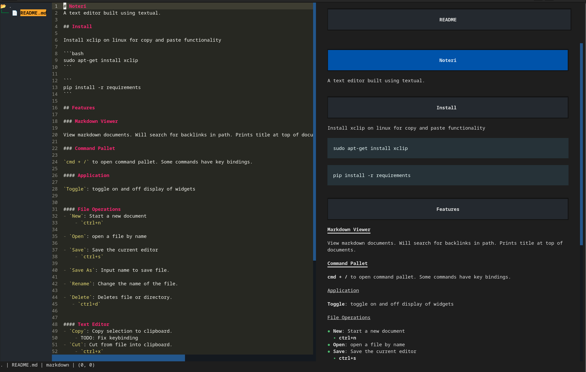

# Noteri
A text editor built using textual.

## Install

Install xclip on linux for copy and paste functionality

```bash
sudo apt-get install xclip
```

```
pip install -r requirements
```

## Features

### Markdown Viewer

View markdown documents. Will search for backlinks in path. Prints title at top of documents.

### Command Pallet

`cmd + /` to open command pallet. Some commands have key bindings.

#### Application

`Toggle`: toggle on and off display of widgets


#### File Operations
- `New File`: Create a new file.
    - `ctrl+n`
- `New Directory`: Create a new directory.

- `Open`: open a file by name

- `Save`: Save the current editor
    - `ctrl+s` 

- `Save As`: Input name to save file.

- `Rename`: Change the name of the file.

- `Delete`: Deletes file or directory.
   - `ctrl+d`


#### Text Editor
- `Copy`: Copy selection to clipboard.
    - TODO: Fix keybinding
- `Cut`: Cut from file into clipboard.
    - `ctrl+x`
- `Paste`: Paste from clipboard into file.
    - `ctrl+v`
- `Link [FILE PATH]`: Link another file

- `Table`: Create a table. With nothing selected, prompts user for row and column size. With selection, will format a table to look nice. Support for tab and return in table.

- `Bullet`: Make a bulleted list out of selection

- `Numbered List`: Make a numbered list out of selection.

- `Table of Contents`: Table of contents from Headings in markdown document.

- `Undo`: Undo text
    - `ctrl+z`
- `Redo`: Redo text
    - `ctrl+y`

## Example Images


